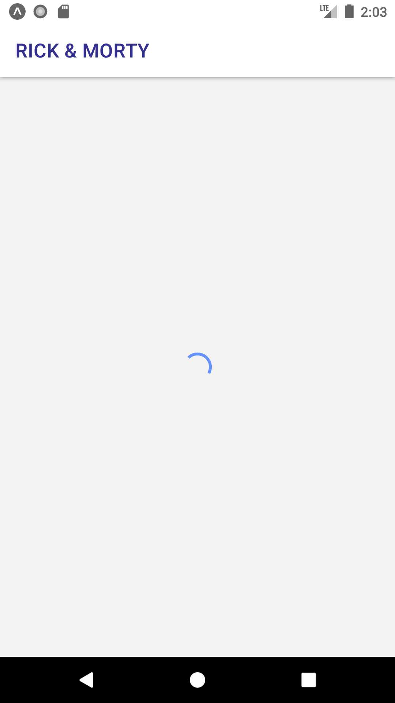
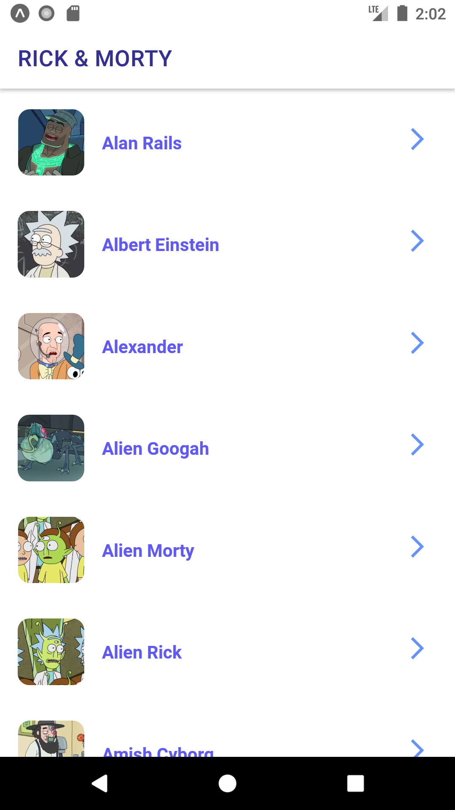
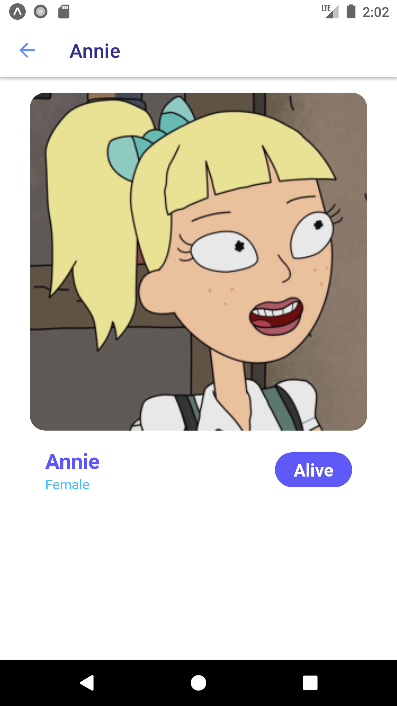

# Rick Morty App

The Rick and Morty App using React Native Expo.

## Screenshots

### Android version

  
  
  
  

### iOS version

  
  
  
  

- See more seecrnshots in `docs / screenshots / ios` or `android` folders.

## Instructions

Node.js and Expo cli is required to run the app.

- Install Android or iOS development environment. Checkout the docs for more information on how to
  [get started with React Native](https://reactnative.dev/docs/getting-started).

### Setup

- Clone repo code `git clone repo-url`

- Run `yarn`, to install all the dependencies.

- Run `yarn start`, to run the expo dev server and then choose which platform to build the app for (a -> android, i -> ios, ...)

## Contributors

Mohamed Aimane Skhairi
skhairimedaimane@gmail.com

## License

This project is created under the MIT license.
